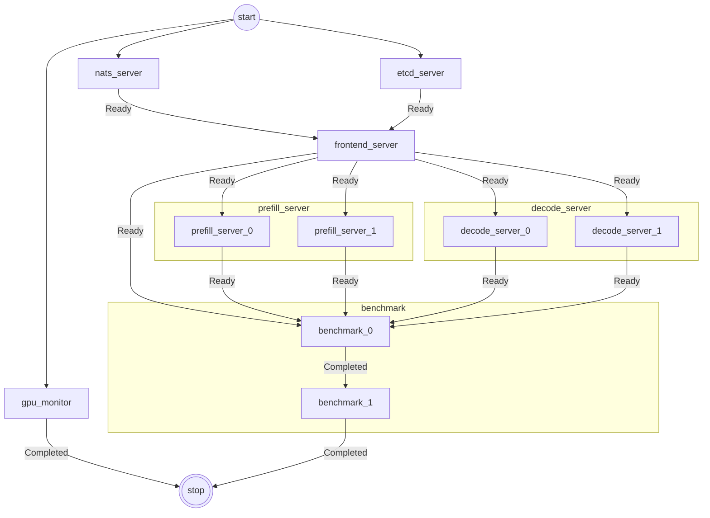
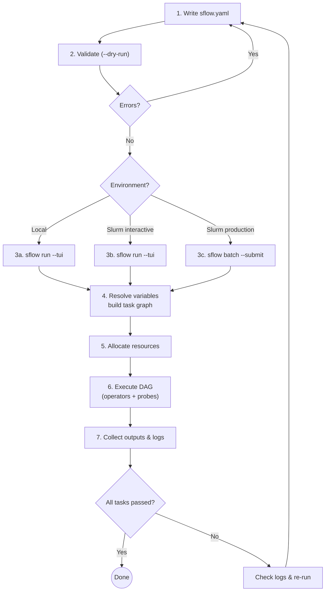
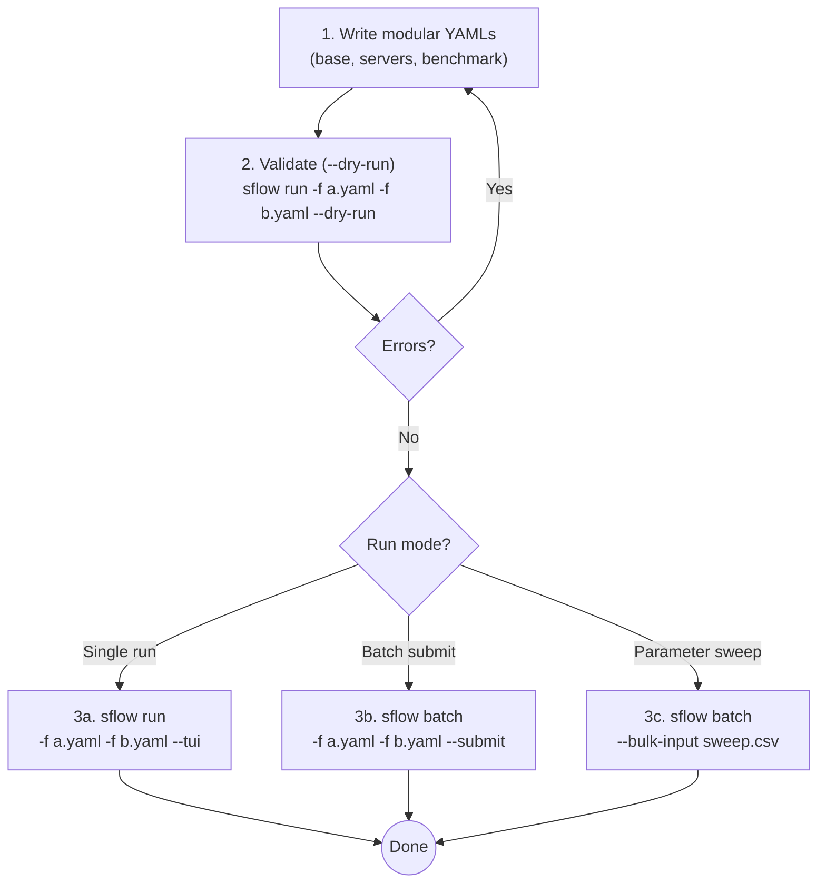

`sflow` is a **declarative workflow descriptor** that separates _what to deploy_ from _where to deploy it_.

An application's deployment steps are usually logically the same regardless of the underlying infrastructure. Take [NVIDIA Dynamo](https://github.com/ai-dynamo/dynamo) as an example: you start etcd and NATS, launch a frontend server, spin up workers that register to the frontend, and the service is up. That logical flow never changes — but making it actually run on Slurm, Docker Compose, or Kubernetes requires a different set of infrastructure-specific scripts, resource management, and networking tweaks each time, and the effort must be repeated for every new platform.

`sflow` is trying to eliminate this duplication. You describe the workflow once in a portable YAML format — tasks, dependencies, resources, and launch methods — and `sflow` delegates execution to the target infrastructure through swappable backends, leveraging each platform's native ecosystem rather than reimplementing it (e.g. Kubernetes, Helm charts, Argo Workflows).

Pluggable extensions such as probes and artifacts integrate naturally without coupling your workflow to any specific platform. Write one `sflow.yaml` and run it across environments with minimal changes.

The current focus is **Slurm**, which — unlike Kubernetes or Docker — lacks a built-in workflow orchestration layer, making multi-step deployments especially cumbersome. Docker and Kubernetes backends are planned to follow.

## Use Cases

### Complex Slurm Workflows

sflow streamlines orchestration within Slurm clusters with built-in support for:

- Automatic hostname/IP detection after allocation
- Workload distribution across nodes and GPUs
- Runtime readiness and failure checks (probes)
- Replica scaling (parallel workers, sweeps)

Define what you want to run — no more hand-crafted bash scripts to manage resource placement or ensure processes land on the right nodes and GPUs. Below is an example DAG for a Dynamo PD disaggregated LLM inference service:

### Cross-Environment Orchestration

Codify startup order, replica scale, readiness probes, and log capture in YAML — then run the same file locally or on a cluster by switching the backend.

### Benchmarking & Experiment Automation

Standardize how you launch runs, capture logs/artifacts, and structure outputs so results are reproducible across teams and machines.

### Local Development & Testing

Use the `local` backend with the `bash` operator to validate your DAG and scripts on your laptop before moving to a Slurm cluster.

## Core Concepts

| Concept | Description |
|---------|-------------|
| **Workflow** | A set of tasks wired into a DAG via `depends_on`. |
| **Task** | An executable unit. The key field is `script` — a list of lines joined into a bash script. |
| **Backend** | Where compute comes from. Built-ins: `slurm` (allocates via `salloc`) and `local` (simulates nodes on the local machine). |
| **Operator** | How a task is launched. Built-ins: `bash`, `srun`, `docker`, `ssh`, `python`. Named operators let you preset flags and reuse them across tasks. |
| **Variable** | A named value referenced as `${{ variables.NAME }}` in YAML or `${NAME}` in scripts. Override from the CLI with `--set`. |
| **Expression** | Jinja2-based `${{ ... }}` syntax inside YAML to reference variables, backend info, task metadata, and more (e.g. `${{ backends.slurm.nodes[0].ip_address }}`). Supports filters (`${{ [a, b] \| min }}`), conditionals, and list indexing. |
| **Artifact** | A named external resource (model, config, dataset) referenced by URI and resolved to a local path at runtime. |
| **Probe** | A health-check gate. Readiness probes block dependents until a service is live; failure probes terminate the workflow when a fatal condition is detected. |
| **Replica** | A task can be replicated N times (parallel or sequential) with per-replica variable overrides for sweeps. |

For detailed architecture diagrams, execution flow, assembly pipeline, orchestrator internals, plugin reference, and output structure, see [Architecture](./architecture.md).

## How to Use sflow (General Workflow)

## Modular Workflow

For larger projects, split config into composable modules and pass them directly to `sflow run` or `sflow batch` -- no separate compose step required. This enables framework swapping, benchmark mixing, and CSV-driven parameter sweeps. See [Modular Workflows](./modular-workflows.md) for details.

### Config Merging Rules

When multiple YAML files are provided:

| Section | Merge Strategy |
|---------|---------------|
| `version` | Must match across all files |
| `variables` | Merge by name (later overrides earlier) |
| `artifacts` | Merge by name |
| `backends` | Merge by name |
| `operators` | Merge by name |
| `workflow.tasks` | Concatenated (later files append tasks) |
| `workflow.name` | Last non-null wins |

## Expression System

The `${{ ... }}` expression syntax (powered by Jinja2) provides access to the full runtime context:

| Namespace | Example | Description |
|-----------|---------|-------------|
| `variables` | `${{ variables.MODEL_NAME }}` | Resolved variable value |
| `artifacts` | `${{ artifacts.MODEL.path }}` | Artifact local path |
| `backends` | `${{ backends.slurm.nodes[0].ip_address }}` | Backend node info |
| `task` | `${{ task.assigned_nodes }}` | Current task's node assignment |
| Filters | `${{ [a, b] \| min }}` | Jinja2 filters |

Expressions are resolved in phases — variables first, then backends, then artifacts, then task-level — so later phases can reference earlier results.

## Known Limitations

The following features are **not yet implemented** in the current release:

- `sflow run --resume` — raises `NotImplementedError`
- `sflow run --task` — raises `BadParameter`
- `hf://` and `docker://` artifact materialization — raises `NotImplementedError`

This user guide reflects actual code behavior. Not all planned features may be available yet.

## Next Steps

| Topic | Page |
|-------|------|
| Architecture, execution flow, plugins | [Architecture](./architecture.md) |
| Run a minimal example | [Quickstart](./quickstart.md) |
| Variables, expressions, env injection | [Variables](./variables.md) |
| Named inputs (paths, images, etc.) | [Artifacts](./artifacts.md) |
| Compute backends (local, Slurm) | [Backends](./backends.md) |
| Task launch methods (bash, srun, containers) | [Operators](./operators.md) |
| Node/GPU placement, NVIDIA_VISIBLE_DEVICES | [Resources](./resources.md) |
| Parallel/sequential replicas, sweeps | [Replicas](./replicas.md) |
| Composable configs, sweeps, missable tasks | [Modular Workflows](./modular-workflows.md) |
| Readiness/failure gates for services | [Probes](./probes.md) |
| Log and output directory structure | [Outputs & Logs](./outputs.md) |
| Full sflow.yaml schema | [Configuration](./configuration.md) |
| CLI options | [CLI Reference](./cli.md) |
| Frequently asked questions | [FAQ](./faq.md) |
